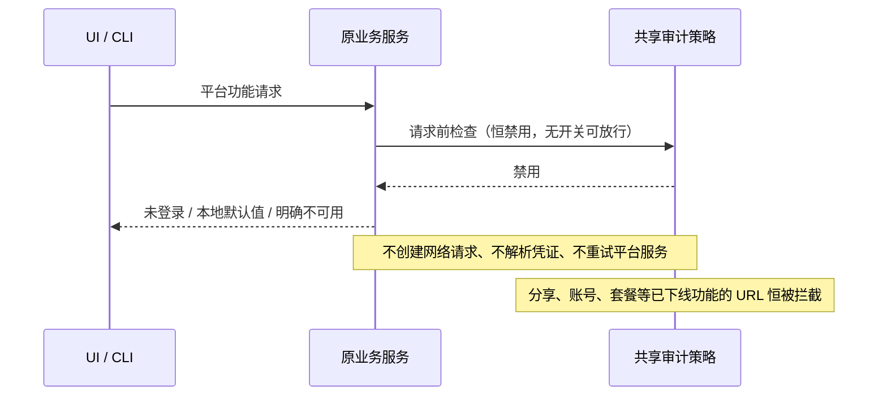

# ZCodium：官方平台断连

官方平台服务已整体删除，没有开关、没有设置入口、没有环境变量。OAuth 登录、刷新、用户资料及远端登出、对话分享、反馈、套餐和额度、官方 MCP 凭证、闲时任务网关、客户端配置和内置模型远端配置一律不连接。反馈指向 https://github.com/eafenzhang/ZCodium/issues。

共享纯策略（`packages/shared/src/officialPlatformPolicy.ts`）是唯一禁用规则：`isOfficialServiceEnabled` 恒为 false，`assertOfficialPlatformAvailable` / `assertOfficialServiceAvailable` 直接抛出「官方平台服务已下线」。各业务服务保留接口、类型和原有本地数据所有者；历史设置文件里的 `officialServices` 字段被 schema 静默丢弃（该字段已不再登记）。OAuth 展示未登录，不删除历史用户数据。无新业务状态、队列或持久化迁移；桌面连续流与手机可恢复流保持现有 Host/lease 所有权。

用户自配模型 URL、密钥、代理和本地功能保持可用；CLI 不再把模型 URL 改写至官方 Coding Plan 网关。官方 CDN 默认市场和图片改为无远端来源，网络边界拒绝历史缓存中的官方平台地址。显式配置的远程资源自建源（`ZCODE_REMOTE_ASSET_CDN_BASE_URL`）视为用户自有配置；用户主动打开系统浏览器的文档链接不受此策略限制。

验收：源码 grep 风格回归扫描主动域名和网络出口；使用会在被调用时失败的网络替身验证 no-op；验证用户模型 URL 和请求参数不被修改；`packages/desktop/tests/no-official-platform.test.mjs` 验证策略模块不含开关入口（`isOfficialPlatformEnabled` 已不存在）、判定恒为禁用、报错指向已下线；运行桌面 no-telemetry 回归、`pnpm typecheck`、`pnpm lint`、架构检查。实际 Electron 启动抓包若未执行必须明确说明。
